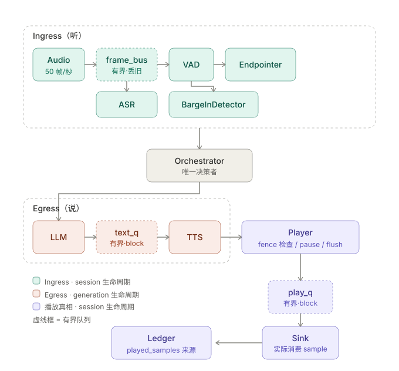

# 实时语音交互引擎 — 设计说明

这个 runtime 要解决的其实只有一个问题：**用户随时会插话，所以"系统生成了什么"和"用户听到了什么"是两个不同的量，而后者才是对话状态的依据。**

如果不承认这件事，代码会长成一条直线：出 LLM、合成、播完、进上下文。这条直线在没人打断的时候完全正常，一旦被打断就全线崩塌——机器人以为自己说过的话用户没听到，下一轮就建立在假的共享状态上。所有的 generation 隔离、播放账本、取消传播，都是为了把这条直线掰开。

以下按我实际写代码的顺序记录设计和取舍。

---

## 架构




主要思想是区分入流和出流。分这两条路的唯一原因是 barge-in。如果按 `Audio → VAD → ASR → LLM → TTS → Player` 一条直线写，VAD 就是流水线第二站，只在用户轮运行；机器人说话期间没有任何东西盯着麦克风，打断在架构层面就检测不到。做出来的是个半双工对讲机，得等机器人说完才能说话。


|                | session 生命周期 | generation 生命周期 |
| -------------- | ---------------- | ------------------- |
| Ingress（听）  | AudioSource / VAD / ASR / Endpointer / BargeInDetector | — |
| Egress（说）   | Player / Sink    | LLM / TTS           |

Player 是唯一跨格的组件：它在数据方向上属于 Egress，但寿命和 Ingress 一样长。三个原因：

- 它持有 fence。fence 是单调的 high-water mark，必须跨轮保持，跟着 generation 死掉就归零了，场景 E 立刻失效。
- 它持有输出流。真实环境里音频设备初始化有几十毫秒，每轮重建纯浪费。
- 打断时要由它报告精确的 `played_samples`。跟着被取消的 generation 一起死，这个数就丢了，账本没法结算。

判断一个组件该放哪格，我用的问题是："用户打断时，这东西该死吗？" Ingress 全部不该死（否则打断之后就聋了，下一句话没人接）；Player 不该死；LLM 和 TTS 该死，它们正在生产已经作废的内容。

### 三种控制机制

上面那张表带来的一个结论：不同组件受不同方式的控制，不是统一 cancel。

- 生产者任务（LLM、TTS）→ **取消**。它们在产废品，越早停越好。
- 长生命周期服务（Player）→ **发指令**：`pause()` / `resume()` / `flush()` / `set_fence()`。不取消它。
- 常驻感知任务（Endpointer、BargeInDetector）→ **切换武装状态**。它们一直活着，只是 arm / disarm。你不能"取消听"。

`cancel` 取消的只有LLM/TTS的对应generation。`close` 则是停止整个session。

---

## Generation 隔离

```python
@dataclass(frozen=True)
class GenerationHandle:
    session_id: str
    turn_id: int
    generation_id: int   # session 内单调递增
```

Player 持有 `active_fence: int`，`write()` 里两道门禁：

```python
def write(self, chunk) -> WriteResult:
    if self._closed:
        log("stale_event_dropped", reason="session_closed")
        return DROPPED
    # 由player判断当前chunk是否还需要播放
    if chunk.generation_id < self._active_fence:
        log("stale_event_dropped", reason="superseded_generation",
            chunk_gen=chunk.generation_id, fence=self._active_fence)
        return DROPPED
    await self._play_q.put(chunk)        # 有界，满了就 block
    return ENQUEUED
```

用 `<` 而不是 `!=`，是因为单调性保证旧的永远小于新的。这样不用维护"已作废 ID 集合"（会无界增长），而且乱序下依然正确——一个迟到的旧 chunk 不可能被误认成新的。进程内其实 `!=` 也够用，但这个写法在拆成多服务之后不用改，就是标准的 fencing token。

检查放在 `Player.write()`，不在 Orchestrator。编排器手上的状态永远可能是过期的；Player 是进程内最后一跳，是最后有机会拦住声音的地方。

`generation_id` 在 endpoint committed 之后、启 LLM 之前由 Orchestrator 分配。每个 Egress 任务在**创建时按值捕获**自己的 handle，不读全局变量。这一条是刻意的：如果任务体内读 `self.current_gen`，打断之后旧 TTS 任务会读到**新**的 gen id，于是它自己吐出来的 chunk 反而合法通过了 fence 检查——保护机制被自己绕过去了。按值捕获让这类 bug 在结构上不可能出现，而不是靠小心。

终态（`COMPLETED / CANCELLED / FAILED / TIMED_OUT`）都是吸收态，进去之后针对该 generation 的任何事件一律归 stale，不区分它为什么迟到。这顺带把"多个 cancel 几乎同时到达"变成天然幂等：只有第一个推动转移，其余记 `duplicate_cancel`。

`turn_id` 的语义：每次 endpoint commit 都是新一轮，所以打断之后 `turn_id` 会 ++。`generation_id` 在 session 内单调、和 turn 独立递增。理由是用户打断后说的确实是新的一句话。代价见文末开放问题第 1 条。

---

## 播放真相

四个状态，关键是写入权：

| 状态 | 写入者 |
| --- | --- |
| `generated` — LLM 出了文本 | LLM 任务 |
| `synthesized` — TTS 出了音频 | TTS 任务 |
| `enqueued` — 过了 fence 进了队列 | `Player.write` |
| `played` — Sink 实际消费的 sample 数 | **只有 Sink** |

前三个都只是意图，只有第四个是现实。我在代码里用写入权强制这一点：`ChunkRecord.played_samples` 只有 Sink 写，其他组件只读。Session 状态机里 `THINKING → SPEAKING` 的转移也由 Sink 报告首帧播出触发，不是 TTS chunk 入队触发——在状态机层面就把这条纪律钉死，比靠注释约束可靠。

```python
@dataclass
class ChunkRecord:
    chunk: TtsChunk
    enqueued: bool = False
    played_samples: int = 0      # 只有 Sink 写
    truncated: bool = False

@dataclass
class GenerationLedger:
    handle: GenerationHandle
    generated_text: str = ""
    records: list[ChunkRecord] = field(default_factory=list)
    was_interrupted: bool = False

    def enqueued_text(self) -> str: ...
    def heard_text(self) -> str: ...
    def played_duration_ms(self) -> float: ...
```

句中被打断时，账本能吐出题目要的四个量：完整生成文本、入队文本、用户实际听到的文本范围、实际播放时长。

### sample 到文本的映射

知道播了一个 1.5s chunk 里的 0.72s，怎么知道对应哪段文字。两条路：

主路径用 word mark。Fake TTS 是我自己写的，让它顺手吐 `(word, start_sample, end_sample)` 几乎免费，真实 provider（Azure、ElevenLabs）也普遍给。`heard_text` 取所有 `end_sample <= played_samples` 的词，**部分播出的尾词不算**。

降级路径给不提供 timing 的 provider：按 sample 比例换算字符位置，然后向下对齐到词边界。

两条都在日志里标 `mapping_method`，因为这本来就是近似，不标出来后面看日志的人会当成精确值。

两条都选择"向下"、少认。理由是误判代价不对称：少认最多让下一轮重复一点内容，是体验瑕疵；多认会让 LLM 引用用户从没听到的信息（"您的确认号是 ABC123"——用户只听到"您的确认号是"），这是正确性错误，而且不会自我修复，会随轮次累积。

下一轮上下文因此不能直接塞 `generated_text`：

```python
content = ledger.heard_text() if ledger.was_interrupted else ledger.generated_text
messages.append({
    "role": "assistant",
    "content": content,
    "metadata": {"interrupted": ledger.was_interrupted,
                 "unheard_chars": len(ledger.generated_text) - len(content)},
})
```

---

## Endpointing 与打断

### 动态阈值

固定静音阈值的根本问题是用一个旋钮控制两个互相冲突的目标：短了打断正在思考的人，长了每轮都有死气沉沉的空白。而同一个 700ms 静音，在 "book it for" 之后意味着没说完，在 "Wednesday afternoon." 之后意味着说完了。一个数字区分不了这两种情况。

我用三个信号合成阈值：VAD 静音时长（计时基准）、ASR partial 稳定时长（还在变说明人还在说）、句子完整度。

完整度是个规则表，不是模型（题目明说不要求语义模型）。尾词落在介词/连词/冠词/填充词表里（`for, to, and, but, the, a, um, uh, so, because...`）判 incomplete；以句末标点或内容词收尾判 complete；其余 ambiguous。

| 判定 | 阈值 |
| --- | --- |
| complete | 400ms |
| ambiguous | 700ms |
| incomplete | 1100ms |

**这三个数是我拍的。** 手上没有真实语料可以调，我只保证了场景 B 的 700ms 静音落在 incomplete 档内并且留了 400ms 余量。真实系统这三个数必须用线上的 endpoint 误判率（抢话率 vs 平均等待）去拟合，而且大概要按语言、按客户分开调。写在这里是为了让读日志的人知道 `effective_threshold_ms` 是哪来的，不是为了说这三个数对。

场景 B 的行为：`"Please book it for"` 尾词是介词 → incomplete → 阈值 1100ms → 700ms 静音不 commit。后半句说完 → complete → 400ms 内确认。不依赖任何一个大的固定阈值。

### 两阶段打断

单阶段有个死结：要抗噪就得等确认，等确认就直接吃掉停播延迟预算。150ms 的确认窗口意味着用户开口后还要多听 150ms 机器人说话。

拆成两阶段就没这个矛盾：

```
用户开口
  ├─ 0~40ms   VAD 连续 2 帧判语音 → speech_start
  │
  ├─ Phase 1  立刻 Player.pause()，记下精确 played_samples
  │           SPEAKING → SPEAKING_PAUSED，log barge_in_candidate
  │           此刻用户已经听不到机器人 → 重叠结束
  │
  ├─ 确认窗口 150ms，继续看 VAD
  │
  ├─ 达标 → barge_in_confirmed
  │           fence++ → cancel generation → flush play_q
  │           → 结算账本 → LISTENING → 新 turn
  │
  └─ 不达标（80ms 噪声）→ barge_in_rejected
              Player.resume() 从暂停位置继续
              false_interruption_count += 1
```

pause 廉价且可逆，所以可以无条件立刻做；真正不可逆的操作（cancel、flush、结算账本）放到确认之后。抗噪保护的延迟成本因此是零。

延迟预算：

| 段 | 预算 | 机制 |
| --- | --- | --- |
| speech-start 检测 | ≤40ms | 2 帧 × 20ms |
| phase-1 决策 | ≤20ms | 1 帧内 pause，不等确认 |
| pause 生效 | ≤20ms | 当前帧播完 |
| **→ 用户听不到机器人** | **≤80ms** | |
| phase-2 确认窗口 | +150ms | 连续语音门槛 |
| commit（fence++ / cancel / flush） | ≤20ms | 纯本地 |
| **→ 逻辑打断完成** | **≤250ms** | 刚好在预算内 |

20ms 那几项是硬下界：帧长 20ms（16kHz 下 320 samples），Player 的停止粒度就是一帧，不做 sub-frame 切分的话不可能更快。这也意味着 `playback_stop` 这个指标永远不会小于 20ms，看日志时别当成 bug。

场景 C 实测（`sample-output/metrics.md`）：

| 段 | 实测 | 预算 |
| --- | --- | --- |
| speech-start detection | 20ms | ≤40 |
| interruption decision | 0ms（与检测同一 tick） | ≤20 |
| playback stop 生效 | 20ms | ≤20 |
| **overlap duration** | **40ms** | ≤250 |
| 逻辑打断完成 | 180ms | ≤250 |

体感停播 40ms、逻辑打断 180ms，差值约等于一个确认窗口（150ms）。这个差值就是两阶段设计的全部价值：抗噪的 150ms 花在了逻辑取消上，没有花在"用户还能听到机器人"上。

### 为什么选 pause 而不是 duck

生产上我大概会选 duck（降音到 20%）——恢复无缝，没有 hiccup，体感更自然，真实产品普遍这么做。

这里选 pause 是因为题目要 `overlap duration` 这个指标。duck 之后"重叠"没有清晰定义了：用户仍然能听到 20% 音量的机器人，你说这算重叠还是不算？pause 让这个指标有明确语义，而且暂停位置精确可用于账本结算。

代价是被拒绝时用户会听到一段停顿再续播。场景 D 实测 60ms（80ms 噪声在第 4 帧就被判掉，没等满确认窗口）；上界是确认窗口加一帧，也就是 170ms。另外 PCM16 直接 pause / resume 会在波形上产生不连续，听起来是一声 click。需要在暂停和恢复处各加 5~10ms 的线性淡出/淡入。**这个还没实现**，见已知局限。

---

## 队列与背压

所有队列有上限，没有例外。

| 队列 | 容量 | 满了怎么办 | 为什么 |
| --- | --- | --- | --- |
| `frame_bus` | 50 帧 / 1s | 丢最旧，计 gap | 麦克风不等人，入口绝不能 block |
| `asr_input` | 25 帧 / 500ms | 丢最旧，记录 | 陈旧 partial 没价值，丢失优于延迟 |
| `text_q` (LLM→TTS) | 16 chunk | block 生产者 | LLM 便宜，等得起 |
| `play_q` (TTS→Sink) | ~400ms 音频 | block 生产者 | 音频不能有洞 |

题目问的四种情况：

**TTS 快于播放器** → block 生产者。音频不能丢，丢了是语音中间一声断裂，没法插值补救；而播放器本身以实时速率消费，有界队列的 block 就已经是精确的限流，不需要再写 rate limiter。

**ASR 慢于输入** → 丢最旧，记 gap 数。音频入口永不 block。

**Provider 长时间无返回** → 首包超时和 chunk 间隔超时分开设（这两种卡死的成因不同，混成一个数就没法定位）→ `provider_timeout` → generation 进 `TIMED_OUT` → 降级。

**关闭时有残留** → 有界 drain，默认 0（直接丢弃并计数），drain 超时可配，超时强制 close。丢弃量作为 `residual_*` 指标输出。

`play_q` 的容量不只是内存参数，它是个延迟/精度旋钮，这点值得单独说：缓冲越大，"已入队未播放"的音频越多，打断时要 flush 掉的越多，账本里"生成了但用户没听到"的灰色地带越大。缓冲越小，jitter 下 underrun 风险越高。400ms 是在 Fake Provider 默认 jitter 配置下的折中，值可配置。

这个论断是可测的，而不是嘴上说说：`tests/test_queues.py::test_play_queue_capacity_is_a_latency_knob` 拿 20ms 和 2000ms 两个容量跑同一个 barge-in，比较账本里 `enqueued_text` 和 `heard_text` 的字符差——缓冲大的那一边灰色地带明显更大。

（这条测试我第一版写错了：小缓冲给的是 100ms。整段回复只有 4 个 chunk，容量 5 和 100 都装得下，队列从没满过，两边结果完全一样。得把小缓冲压到 1 个 chunk 才测得出来。）

顺带一个真实系统的坑：这里 Sink 是最后一站，所以 flush `play_q` 就等于真的停了。但真实实现下 PortAudio / ALSA 还有一层驱动缓冲，那一层才是真正的最后一跳，flush 不掉。所以生产上"最后有机会拦住声音的地方"比这个 demo 更靠后，fence 检查也得跟着往后挪。

---

## 生命周期与拆除

```
SessionSupervisor  (outer TaskGroup + session CancelScope)
├── ingress_task   ─┐
├── vad_task        │
├── asr_task        ├─ session 生命周期
├── endpoint_task   │
├── player_task    ─┘
└── generation_scope  (inner TaskGroup + generation CancelScope)
    ├── llm_task   ─┐ generation 生命周期
    └── tts_task   ─┘
```

Session 是生命周期的唯一 owner。所有任务都由 `asyncio.TaskGroup` 托管，代码里没有裸 `create_task`，所以结构上不可能有孤儿任务。这一点用测试断言 close 之后 `asyncio.all_tasks()` 回到基线来证明，不靠人肉 review。

七种情况：

| 情况 | 处理 |
| --- | --- |
| 正常完成 | Sink 播完末个 chunk → `COMPLETED` → 结算账本 |
| 用户打断 | fence++ → 取消 inner scope → flush → 结算（部分听到） |
| Provider 超时 | 分级超时 → `TIMED_OUT` → 取消 inner scope → 降级 |
| 客户端断开 | 等同 session close |
| 主动关闭 | 见下面的拆除顺序 |
| 后台任务抛异常 | TaskGroup 自动上抛 supervisor → 记录 → 降级或失败。不 catch-all 吞掉 |
| 多个 cancel 并发 | 吸收态天然幂等，非首个记 `duplicate_cancel` |

拆除顺序是固定的，顺序错了就会出场景 E 第三条那个问题：

```
cancel outer scope
  → await 所有任务（带超时）
  → 关 provider
  → 关 Player（置 _closed）
  → 发 session_closed
```

Player 最后关，而且带 `_closed` 硬门禁。即使有任务没死透（provider 的 cancel 本来就是 best-effort），它也写不进播放器。**"await 任务之后再关 Player"和"Player 有 closed 门禁"是两道独立的保险，两个都要有**——只靠前者，任何一个 await 超时都会漏；只靠后者，任务泄漏就检测不出来。

---

## 时钟

用可注入的虚拟时钟，核心测试全跑虚拟。

理由很实际：`≤250ms` 这种断言在真实时钟下、在负载高的 CI 机器上必然 flaky，而且场景 C 那 4 秒播放要真等 4 秒。虚拟时钟下测试瞬间跑完且完全确定，同一个 seed 出同一条 trace，这对"能只看日志解释这次执行"这个要求也是必需的。

实现是 `Clock` 协议（`now()` / `sleep()`），虚拟实现在所有任务都 idle 时把时间跳到下一个待触发的 timer。Sink 按"每虚拟毫秒 N samples"消费。

虚拟时钟看不见的东西：事件循环被长时间同步任务阻塞导致的延迟超标。真实系统里这是 barge-in 延迟爆预算的头号原因（音频重采样、日志同步落盘都能干出这事），而虚拟时钟下时间只在所有人 idle 时推进，这类问题在测试里根本不会发生。这是我明确接受的盲区，写在局限里。

---

## 设计问答

**谁是"实际播放状态"的唯一事实来源？**

Sink，依据是实际消费掉的 sample 数。不是 TTS、不是队列、不是编排器——那些报告的都是意图。代码里靠写入权强制：`played_samples` 只有 Sink 能写。

在这个 demo 里 Sink 就是最后一站。真实系统里它不是，驱动缓冲在它后面，那一层才是真事实来源。

**为什么 TTS cancel 不足以完成一次可靠打断？**

三个独立原因，而且第二个才是要害。

一，cancel 是异步的，in-flight 的 chunk 照样到（场景 E 就是在模拟这个）。二，**已经入队和已经在播放器缓冲里的音频会继续出声**——就算上游立刻停死，用户还会听到剩下那几百毫秒。三，provider 自己有内部缓冲，它的 cancel 语义本来就是 best-effort。

可靠打断是四件事：停 Sink、flush 队列、fence++ 作废 generation、取消上游。cancel 只是其中一件，而且是对"用户还能不能听到"贡献最小的那件——那件事完全由前两步决定。

**为什么 generated text 不能直接进下一轮上下文？**

因为用户可能只听到了一部分。机器人以为自己说了"已为您确认周三下午三点，确认号 ABC123"，用户实际听到"已为您确认周三下—"，之后每一轮都建立在错的共享状态上：机器人引用一个用户从没听到的确认号，用户追问时机器人觉得自己已经答过了。

这类错误的性质是不会自我修复、而且随轮次累积。所以上下文只放 `heard_text()`，并且显式标 `interrupted`，让模型知道自己被打断了。

**固定静音阈值的问题是什么？增加确认时间怎样影响 barge-in latency？**

前半段上面 Endpointing 那节说了：一个旋钮，两个冲突目标，而且真实停顿时长随语速、语言、以及"句子说完没"剧烈变化，同一个 700ms 在不同语境下含义相反。

后半段：单阶段设计下确认窗口是 1:1 从停播延迟里扣的，150ms 确认就是让用户多听 150ms。两阶段设计下它只影响逻辑取消的时点，不影响体感停播（Phase 1 已经静音了），所以抗噪的延迟成本是零。这是我引入两阶段的唯一理由——如果不要求 250ms，单阶段更简单。

**TTS 快于播放时：阻塞、丢弃、限流还是取消？**

阻塞。音频丢了会有可听见的断裂且无法补救；播放器以实时速率消费，有界队列的 block 本身就是精确限流，不必再写 rate limiter；而且小缓冲同时让打断更便宜、账本更精确。

另外三个策略各有其位：丢弃用于入口（音频帧进慢 ASR，陈旧比丢失更糟）；取消用于整个 generation 已经作废（打断、超时）；独立 rate limiter 在这个架构里没有位置。

**拆成三个独立服务后，事件顺序和取消语义会多出哪些问题？当前实现最可能在生产出的三个故障是什么？**

多出来的问题：

网络不保证顺序，重试引入重复，需要 per-generation 单调 sequence + 消费端幂等。我的 fence 用 `<` 比较就是为这个预留的，乱序下不用改。

cancel 退化成 best-effort RPC，可能丢、可能延迟、可能和它想取消的数据乱序（cancel 比数据先到）。光发 stop 消息不够，**每一跳都得做 fencing**，各自持久化 high-water mark，否则一个丢掉的 cancel 就等于旧音频被播出去。

时钟偏移让跨服务延迟指标失去意义。250ms 这种断言需要单一权威时间线：要么逻辑时钟，要么全部延迟由同一个服务测量。

部分失败：TTS 取消成功但播放服务没收到 → 机器人继续说。所以判据必须是"播放服务的状态"，不是"取消调用返回成功"。

还有播放真相跨了网络。Sink 的进度上报必然迟到，编排器手上的播放状态永远是过期快照，结算账本前得等一个有界的确认窗口。

**当前实现最可能出的三个故障**（都是这份实现自己的弱点，不是通用清单）：

1. **fence 检查的位置。** 我放在 `Player.write()`，因为那是进程内最后一跳。拆成服务后如果沿用这个位置，从编排器跨网络到播放服务之前那一段就没有保护，旧 generation 的音频会被播出来。检查必须跟着"最后一跳"往后挪——而"最后一跳"在真实实现里还要再往后，因为 PortAudio / ALSA 的驱动缓冲在 Sink 后面，那一层 flush 不掉。

2. **高负载下 barge-in 延迟爆预算。** Phase 1 的 pause 依赖事件循环及时调度。同进程里有任何长时间同步任务（重采样、同步日志落盘）把循环堵住，pause 就会被推迟几十毫秒。而虚拟时钟测试对这类问题完全免疫——也就是说我的测试**不可能**发现它。这是明确接受的盲区，见「已知局限」第 4 条。

3. **异常路径下的上下文污染。** turn 以 provider 超时或客户端断连结束时（不是干净打断），账本结算走的是覆盖较少的分支，容易 over-claim 用户听到了什么，然后复现上面第三问那个累积性错误。这条不是猜的：实现过程中真的踩到了一个同族的问题——LLM 抛异常时 TTS 还阻塞在 `inq.get()` 上，`asyncio.wait` 默认 `ALL_COMPLETED` 所以不返回，最后是看门狗兜住的，终态被记成 `timed_out` 而不是 `failed`。功能上没崩，但归因错了。修法是 `return_when=FIRST_EXCEPTION`，回归测试在 `tests/test_trace_integrity.py`。

---

## 已知局限

1. **完整度规则表是英语特化的。** 语序自由的语言要重写整套规则——日语的句末助词、中文的语气词，判据完全不同。生产环境该换成轻量分类器，或者直接用 ASR 自带的 endpoint 置信度（我的 Fake ASR 没模拟这个信号）。

2. **阈值三档（400/700/1100）是拍的。** 没有真实语料可以调，只保证了场景 B 的 700ms 落在 incomplete 档内并留了余量。

3. **pause / resume 处没做淡入淡出。** PCM16 直接切会在波形上产生不连续，听起来是一声 click。需要各加 5~10ms 线性 fade。知道怎么做，时间没排上。

4. **虚拟时钟看不见事件循环被阻塞。** 真实系统里这是 barge-in 延迟爆预算的头号原因，而虚拟时钟下时间只在所有人 idle 时推进，这类问题在测试里根本不会发生。明确接受的盲区。

5. **虚拟时钟用了一个私有属性。** `VirtualClock._drain_ready()` 靠 `loop._ready` 判断"没人可跑了"，这是 CPython 的私有 API，换版本可能失效（3.10 上验证过）。如果允许加依赖，trio 的 `MockClock` + `autojump_threshold` 是现成且正确的做法——它在框架层面就知道所有任务的阻塞状态，不需要猜。纯公有 API 的替代是固定 yield N 次再跳表，但 N 选小会漏任务、选大会浪费。我选了精确但脆的那个，并加了 `guard` 上限：ready 队列一直不空会抛 `RuntimeError` 而不是静默死循环。

6. **没有真实时钟的 smoke test。** 上一条的直接后果：现在没有任何用例能证明代码不依赖虚拟时钟的特殊行为。加一个就能补上，是最该先做的下一件事。

7. **降级文本映射路径的精度没量化。** 实现了也测了（`tests/test_ledger.py` 里单元和端到端各一条），但没给出和 word-mark 路径的误差分布。

8. **overlap duration 假设播放是连续的。** Sink 连续消费、chunk 之间没有间隙，所以"播放中"等于"在出声"。真实系统里 chunk 之间可能有静音（TTS 的自然停顿，或者 underrun），那时用户开口其实没有重叠。要算准得按帧记录"这一帧是否有非静音输出"再取交集。

9. **单会话。** 没有多会话资源竞争、跨会话背压、全局并发上限。

---

## 开放问题

代码里做了选择但我不确定是最优的，列在这里而不是假装没有。

1. **`turn_id` 在打断之后 ++ 了。** 实现选择是：每次 endpoint commit 都是新一轮，`generation_id` 在 session 内单调、和 turn 独立。理由是用户打断后说的确实是新的一句话。反面是：如果用户打断之后说的是同一件事的补充（"周三下午——不，改成三点"），把它算成两轮会让上下文归因变散。这个决定影响日志怎么查，所以写出来。

2. **barge-in rejected 之后没有重说被截断的半个词。** 实现复杂度不值，但如果截在数字中间（"three-hun—"）体验会很差。

3. **连续 rejected 没有动态提高确认门槛。** 连续被噪声打断说明环境确实吵，继续用 150ms 会一直误判。倾向做，但会让"确认窗口"变成状态相关的量，日志和指标都得跟着改。

